<p align="center">
  
</p>

# lothc

[](https://pypi.org/project/lothc/)
[](https://github.com/RogerThomas/lothc/actions/workflows/ci.yml)
[](https://codecov.io/gh/RogerThomas/lothc)
[](https://pypi.org/project/lothc/)
[](LICENSE)

**L**ord **O**f **T**he **H**ttp **C**lients — a typed HTTP client for Python, built on
[pyreqwest](https://github.com/mostafa-hussein/pyreqwest) (a Rust-backed HTTP client), with first-class
optional support for **pydantic**, **msgspec**, and **TypedDict** (validated via **typeguard** if
installed) as decode targets.

```python
from lothc import HTTPClient
from pydantic import BaseModel


class Pokemon(BaseModel):
    id: int
    name: str


async with HTTPClient.build(base_url="https://pokeapi.co/api/v2/") as client:
    pikachu = await client.get("pokemon/pikachu", response_data_type=Pokemon)
    print(pikachu)  # id=25 name='pikachu'
```

## Fast



Benchmarked with [`perf.py`](perf.py) against a tiny Rust-based static JSON server, 10,000 requests at
concurrency 100 — including lothc's fully-typed decode targets (`response_data_type=` a msgspec
`Struct`, a pydantic `BaseModel`, or a `TypedDict` validated via typeguard), not just raw bytes or
an untyped dict. The object handed back from those runs isn't just parsed JSON — it's a real,
constructed, field-validated instance of your own type, and that validation cost is included in
the numbers, not benchmarked around. Decoding into a real msgspec `Struct` even edged out the
unvalidated dict path in this run; typeguard's pure-Python validation was the one clear exception,
costing a real, visible slowdown. Full numbers: [docs/benchmarks.md](docs/benchmarks.md).

## Highlights

lothc's biggest offering over `requests`/`httpx`/`aiohttp`-and-friends: those clients hand you a
plain `dict` from `.json()` and leave validation to you. Pass `response_data_type` to any lothc
call and get back a real, constructed, field-validated pydantic `BaseModel`, msgspec `Struct`, or
typeguard-checked `TypedDict` instead — built in, not bolted on. See
[Benchmarks](docs/benchmarks.md) for what that costs (usually nothing).

| | |
|---|---|
| **Two clients, one API** | `HTTPClient` (async) and `SyncHTTPClient` (sync) — identical surface, both backed by pyreqwest. |
| **Every verb** | `get`/`get_result`, `post`, `put`, `patch`, `delete`, `head`, `download` — see [Verbs](docs/verbs.md). |
| **Typed params, headers & forms** | A `BaseModel`/`Struct` for query params or headers (with `None`-field omission), or a real multipart body via `form=`. |
| **Precise static types** | Every verb is paired `@overload`s, not a cast-laden generic — your editor knows the exact return type. |
| **SSE & streaming** | Typed SSE decode (discriminated unions included), plus raw or NDJSON-typed `stream_get`/`stream_post` — see [SSE](docs/sse.md) / [Streaming](docs/streaming.md). |
| **Retries with real backoff** | `max_retries`/`retry_methods`, a genuine pyreqwest middleware hook, `Retry-After`-aware — see [Retries](docs/retries.md). |
| **Authentication** | Static `bearer_token`, a per-request-refreshed `bearer_auth`, or `default_headers` for anything else — see [Authentication](docs/auth.md). |
| **Cookies, redirects, proxy** | `cookie_store`, `follow_redirects`/`max_redirects`, `proxy=` — see [Networking](docs/networking.md). |
| **A real error hierarchy** | `HTTPTransportError`/`HTTPTimeoutError`/`HTTPConnectionError` for no response, `HTTPResponseError` for 4xx/5xx — see [Error handling](docs/errors.md). |
| **Everything optional** | pydantic, msgspec, typeguard — works with none, either, or all three installed. |

## Installing

```
uv add 'lothc[pydantic,msgspec,typeguard]'
```

(Any subset of the extras works — the base package alone gets you `bytes`/`JSON`/`TypedDict`-without-validation support.)

## Development

See `CLAUDE.md` and `style-guide.md` for architecture notes and the (non-obvious in places) design
conventions this codebase relies on.

```
task deps-sync    # install
task test         # run tests
task check        # lint + format-check + typecheck (what CI runs)
```
